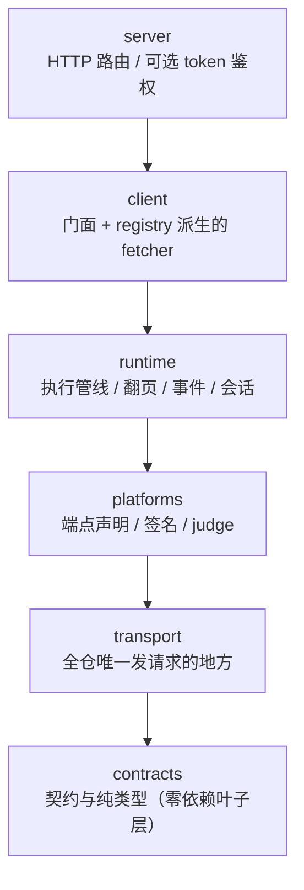
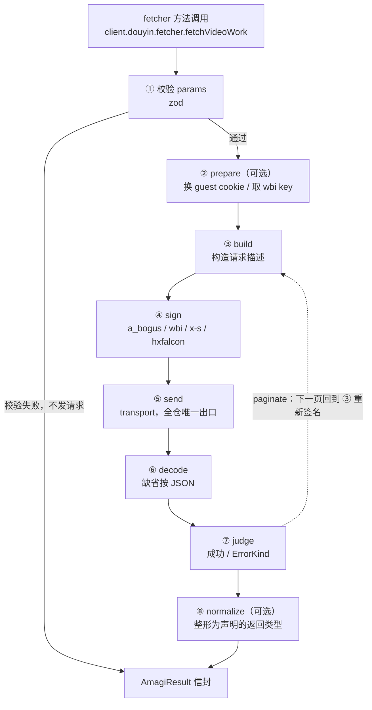

# 项目架构

v7 架构建立在三个决策上：

1. **一个端点一份声明。** 新接口写成一份 `defineEndpoint` 端点声明，参数类型、运行时校验、HTTP 路由、fetcher 方法与文档全部由它派生 —— 加一个接口从 v6 的「改 11–15 个文件」降到「改 1 个文件」。
2. **单向依赖。** 代码按层组织，方向被 CI（`dpdm` 0 环）钉死。
3. **统一信封。** 所有平台、所有调用返回同一个 `AmagiResult<T>`，成功与失败的字段名跨平台一致。

设计总纲见仓库根目录 `docs/v7/README.md`，执行清单见 `docs/v7/PRD.md`；本页是这两份文档面向站点的摘要。

<Callout type="info">
  本页是**总览**：每一层做什么、依赖方向怎么定、端点声明长什么样。
  逐子系统的机制细节（管线九个阶段、签名器装配、事件三根线、翻页收敛条件、导出面全貌）
  在[内部机制](/docs/v7/dev/internals)那一组里 —— 那几页写给 AI 代理与要改内部结构的人。
</Callout>

## 目录结构

核心代码在 `packages/core/src/`，六个职责层（`contracts` / `transport` /
`platforms` / `runtime` / `client` / `server`）加一个入口 `index.ts`，逐层职责见下面各小节。

下面这棵树**不是手抄的**：构建期用 glob 扫 `packages/core/src/**/*.ts` 现生成
（`<auto-files>`），点开即是磁盘上的真实结构。目录一改，这页跟着改，不存在抄漏或过期。

<auto-files dir="../../../../../core/src" pattern="**/*.ts" />

因此它也会如实显示：仓库当前仍处于 v6 → v7 过渡收尾，`src/` 下还残留 `model/`、
`platform/`、`validation/`、`types/`、`utils/` 等旧目录与 v6 低阶入口
（`transport/legacy.ts` 等 @deprecated 保留点），正按阶段 6 的删除清单清理。
本文描述的是 v7 的**目标**结构：**新增代码一律进上面六层**，不在旧目录里落任何新东西。

### contracts —— 零依赖叶子层

谁都可以依赖它，它不依赖仓库内任何其他模块（外部只有 zod 的类型导入）。

| 文件          | 内容 |
| ------------- | ---- |
| `result.ts`   | `AmagiResult<T>` / `AmagiSuccess<T>` / `AmagiFailure` |
| `error.ts`    | `AmagiError` / `ErrorKind`（12 个大类）/ `AmagiErrorCode` / `Judge` |
| `meta.ts`     | `AmagiMeta` / `RequestTrace` / `TraceReason` |
| `request.ts`  | `RequestSpec` / `RawResponse` / `RequestConfig` / 大小写不敏感的 `AmagiHeaders` |
| `cookie.ts`   | cookie 解析与序列化（全仓唯一实现） |
| `platform.ts` | `Platform` 联合类型 |
| `endpoint.ts` | `EndpointDef` / `defineEndpoint` / `Registry` |
| `session.ts`  | 会话契约：`LoginState` / `LoginSession` / `QrcodeLoginStrategy` |
| `ua.ts`       | 浏览器指纹基线（UA / Sec-Ch-Ua，四个平台的版本号集中一处） |

### transport —— 全仓唯一发请求的地方

| 文件        | 内容 |
| ----------- | ---- |
| `client.ts` | `HttpClient.send(spec) → RawResponse`，收发都在这里 |
| `retry.ts`  | 重试与退避策略 |
| `trace.ts`  | `RequestTrace` 收集 |
| `legacy.ts` | v6 低层网络入口（`fetchData` / `fetchResponse` 等，@deprecated 保留） |

「全仓只有 transport 能发请求」是架构约束：端点要发请求（换 guest cookie、取 wbi key）只能通过 `ctx.send`，由 transport 注入 —— v6 里 `wbi.ts` 绕过 `fetchData` 直连 axios 的问题（缺陷 A5）在结构上不再可能发生。

### platforms/\<platform\> —— 平台实现

| 路径                    | 内容 |
| ----------------------- | ---- |
| `api.ts`                | URL 构造（纯函数，不发请求） |
| `sign/`                 | 签名算法（从 v6 原样搬迁，不改逻辑，有逐字节快照测试保护） |
| `judge.ts`              | 平台响应判定 → 成功 / `ErrorKind` |
| `config.ts`             | 默认请求头基线 |
| `decode/`               | protobuf / multi-JSON / HTML 等特殊解码（douyin / bilibili） |
| `assemble/`             | 多请求聚合的归一化（仅 kuaishou） |
| `session/`              | 登录会话策略（仅 douyin / bilibili） |
| `endpoints/*.ts`        | 每端点一份 `defineEndpoint` 声明 |
| `endpoints/index.ts`    | 汇总成平台 registry |

### runtime —— 管线与横切能力

| 文件         | 内容 |
| ------------ | ---- |
| `execute.ts` | 端点执行管线 |
| `paginate.ts` | 声明式翻页 |
| `events.ts`  | 事件总线（实例级） |
| `session.ts` | 登录会话引擎（轮询循环 / 退避 / 超时 / challenge 编排） |

### client 与 server

| 路径                 | 内容 |
| -------------------- | ---- |
| `client/createClient.ts` | 门面 `createClient(options)` —— 默认导出 `amagi(options)` 与 `@deprecated` 的 `createAmagiClient` 都是它，返回 `{ events, on, once, startServer, douyin, bilibili, kuaishou, xiaohongshu }`，douyin / bilibili 还带 `login` |
| `client/fetcher.ts`  | 从 registry 派生**绑定** fetcher（cookie 绑在 ctx，方法签名 `(options, requestConfig?)`） |
| `client/static.ts`   | 从 registry 派生**静态** fetcher（`douyinFetcher` / `amagi.douyinFetcher` 形态，cookie 按次传） |
| `client/method-names.ts` | 端点名 → v6 方法名（**全仓唯一手写映射**） |
| `server/routes.ts`   | 从 registry 派生 HTTP 路由 |
| `server/auth.ts`     | 可选 token 鉴权 |

## 依赖方向

`contracts` 在最底层、`server` 在最顶层，箭头指向被依赖方：



即 transport 只能依赖 contracts；platforms 只能依赖 transport 与 contracts；越往上能依赖的层越多，任何反向或跨越依赖都是错误 —— CI 用 dpdm 检查，**必须报 0 环**（v6 的 36 处循环依赖是缺陷 1，直接促成这层设计）。

两个容易破环的难点是这样解决的：

- **端点钩子要发请求，但 contracts 不能依赖 transport。** `EndpointCtx` 在 contracts 里只声明 `send` 的**形状**，实现由 transport 在运行时注入（依赖倒置）。
- **transport 要上报事件，但不能反向依赖 runtime/events。** 事件总线交给 transport 的只是一个 `emit(event, { trace })` 出口，`meta` 由 runtime 侧补上。

## 数据流

一次 fetcher 调用在管线里的旅程。`build` 返回数组时 ③ 之后是多请求聚合 / 分段并发，
`judge` 缺省取平台自己的那份：



图里那条虚线就是声明式翻页（`paginate`）：每页都完整走一遍 ③ → ⑦ 并重新签名，
最后合并成一次结果。整段调用从头到尾只有一个 `requestId`，实际发出几个请求看 `meta.attempts`。

## 端点声明

新接口 = 一份端点声明。真实例子（`packages/core/src/platforms/douyin/endpoints/videoWork.ts`）：

<include lang="ts" meta='title="packages/core/src/platforms/douyin/endpoints/videoWork.ts"'>../../../../../core/src/platforms/douyin/endpoints/videoWork.ts</include>

`defineEndpoint` 运行时是恒等函数，全部价值在类型推导：`TParams` 从 `params` 推出，`TData` 从 `response` / `normalize` / `compute` 推出。响应类型**直接复用 v6 的 `types/ReturnDataType` 快照类型**（映射键与端点短名一一对应），v6 快照自带顶层索引签名，平台加字段不算 breaking。

可选槽位（每种对应一种非常规端点形态）：

| 槽位        | 什么时候用 |
| ----------- | ---------- |
| `doc`       | 文档元数据：OpenAPI `summary` / `description` 的唯一出处（类型上可选，**新增端点必写**；`tags` 不在声明里 —— 平台就是 tag，由 `name` 的平台段派生） |
| `prepare`   | 前置请求：换 guest cookie、取 wbi key、bootstrap 指纹 |
| `build`     | 构造请求描述；返回数组 = 多请求聚合 / 分段并发 |
| `sign`      | 签名器名 / `false`（显式不签名）/ 一次性函数 |
| `decode`    | 响应不是普通 JSON：protobuf / multi-JSON / HTML |
| `paginate`  | 声明式翻页：`maxPageSize` / `items` / `hasMore` / `nextParams` |
| `partial`   | 多请求部分失败语义：`'tolerate'`（缺失部分留空）/ `'fail'` |
| `judge`     | 覆盖平台默认判定 |
| `normalize` | 把响应裁剪 / 整形为最终 `data` |
| `compute`   | 纯本地计算，不发请求 |
| `response`  | 响应类型令牌 `type<Foo>()` |
| `retryOn`   | 命中这些错误码时重试（如 B站 `-412` → `RISK_CONTROL`） |

每个平台的 `endpoints/index.ts` 把全部声明汇总成 registry 对象。派生时有两条自动保证：fetcher 方法集合自动跟随 registry；路由唯一性在派生路由时校验，同平台内 `route` 重复会直接抛错（v6 抖音 5 个端点撞同一路由的 #47/#48/#54 就是这么修的）。

### 声明派生出什么

| 派生物 | 来源 |
| ------ | ---- |
| fetcher 方法（client 绑定形态 + 静态形态） | 声明 + `client/method-names.ts` |
| 参数类型与运行时校验 | `params` schema 推导（参数类型不再手写第二遍） |
| HTTP 路由 | `route` → `server/routes.ts` 注册 |
| 响应类型 | `response` / `normalize` / `compute` 推导 |
| registry 结构测试 | `test/platforms/<platform>/endpoints.test.ts` 锁注册表规模与路由 |

fetcher 方法名默认按「`fetch` + 端点短名首字母大写」规则派生；**只有不规则名**（`parseWork`、`searchContent`、`convertAvToBv` 等 15 个）才需要动 `client/method-names.ts`。这张表是全仓唯一手写映射 —— 漏一个等于某个方法凭空消失，因此有测试拿四个平台的活 fetcher 对象逐个核对。

## 统一响应信封

所有对外 API 返回同一个信封：

```ts twoslash
import type { AmagiResult } from '@ikenxuan/amagi'

declare const r: AmagiResult<{ id: string }>

if (r.success) {
  r.data // 收窄后是 { id: string }
} else {
  r.error // 收窄后是 AmagiError
}
```

三条硬约束：

1. **顶层没有 `code`。** v6 用同一个 `code` 混装 HTTP 状态码、平台业务码与内部码；v7 各归各位 —— HTTP 状态在 `error.http.status`，平台业务码在 `error.platform.code`，amagi 自己的错误码在 `error.code`。成功信封因此没有任何多余字段。
2. **成功分支没有 `error` 键，失败分支没有 `data` 键。** v6 用 `undefined as never` 声明占位、键却留在运行时对象里；v7 直接不声明。
3. **`success` 是唯一判别键。** `if (r.success)` 之后 `data` 可用、`else` 之后 `error` 可用 —— v6 的成功分支代码零改动。

另有运行时保证：**信封永不 reject**。参数校验失败、平台业务错误、网络错误、内部异常全部映射为 `success: false`。注意这是行为变化：v6 里参数校验失败会 `throw`，v7 里不再进 `catch`。

失败分支的 `error` 形状：

<auto-type-table path="../../../../../core/src/contracts/error.ts" name="AmagiError" />

成败判定收敛到一处：每个平台一份 `judge.ts` 纯函数，把原始响应映射为「成功 / 某个 `kind`」。v6 里 4 个 `internal.ts` 与 `GlobalGetData` 各自为政的判定逻辑（缺陷 A2）在 v7 里只剩这一个判定点。

## 事件总线与 meta

v6 的事件系统有两个问题：总线是**全局单例**（一个 `amagiEvents` 全库共用），且事件负载里没有任何关联 id（缺陷 10）—— 多实例并发时监听器分不清事件来自谁。v7 的两个对应变化：

**实例级总线。** 每个 `amagi()` 实例自带一条总线：`client.events` / `client.on` / `client.once`，实例之间互不串扰。静态 fetcher（`amagi.douyinFetcher.fetchXxx(...)`，不经过 client 实例）**不发事件** —— 它的签名是 v6 冻结的三参形式，没有装总线的位置，要观测就用 client 形态。

**所有负载都带 `meta`。** 15 个事件名（12 个与 v6 逐名对齐 + 3 个 v7 独占的 `session:*`）与各自的负载见[事件系统](/docs/v7/usage/guide/events)，这里只列最常用的四个：

| 事件           | 时机                     | 负载                |
| -------------- | ------------------------ | ------------------- |
| `api:success`  | 一次逻辑调用成功返回     | `{ meta, data }`    |
| `api:error`    | 一次逻辑调用失败返回     | `{ meta, error }`   |
| `http:request` | 一次底层请求即将发出     | `{ meta, trace }`   |
| `http:response`| 一次底层请求已经结束     | `{ meta, trace }`   |

`meta` 挂在每个信封与每条事件负载上：

<auto-type-table path="../../../../../core/src/contracts/meta.ts" name="AmagiMeta" />

`trace` 里的每条请求还标注 `reason`：`initial`（首次）/ `retry`（重试）/ `page`（翻页）/ `segment`（分段并发）/ `prepare`（前置请求）。一次「翻 3 页 + 1 次重试」的调用，`attempts === 4`、trace 里有 4 条记录 —— 重试叠乘（A4）与事件无法归因这两类问题从此有直接可观测的数字。

## 会话（登录）

扫码登录这类**多步有状态流程不是端点**：douyin / bilibili 的 `client.<platform>.login` 提供 `qrcode()`（新建会话）与 `resume()`（从 `serialize()` 的产物恢复）。

引擎（`runtime/session.ts`）负责轮询循环、退避、超时、取消与 challenge 编排；平台策略（`platforms/<platform>/session/qrcode.ts`）只写协议细节。会话状态以 `LoginState` 的 `phase` 判别：`pending`（二维码就绪）→ `scanned`（已扫待确认）→ `challenge`（需应答短信 / 图形验证码）→ `success`（产出 `credential`）；终止态为 `expired` / `rejected` / `risk` / `failed`。

消费方式三种：`watch()` 回调（`onQrcode` / `onScanned` / `onChallenge` / `onSuccess` 等）、`for await`（AsyncIterable）、手动单步（`start()` + `next()`）。v6 抖音 passport 的 4 个顶层方法（`requestPassportQrcode` 等）作为 `@deprecated` 保留在静态 fetcher 上，新代码请走 login 会话。

## 术语

| 术语 | 含义 |
| ---- | ---- |
| 端点（endpoint） | 一个可调用的平台接口，如 `douyin.videoWork`。v6 里叫 `methodType` |
| 注册表（registry） | 一个平台全部端点声明的汇总对象 |
| 信封（envelope） | `AmagiResult<T>`，包裹 data 或 error 的统一外层结构 |
| 判定（judge） | 把平台原始响应映射为「成功 / 某种 `ErrorKind`」的纯函数 |
| 规范化（normalize） | 把平台原始响应裁剪 / 整形为端点声明的返回类型 |
| 会话（session） | 多步有状态流程（如扫码登录），与单次请求的端点区分开 |
| 凭证（credential） | 会话成功后产出的登录态，统一为 `{ cookie, expiresAt?, raw }` |
