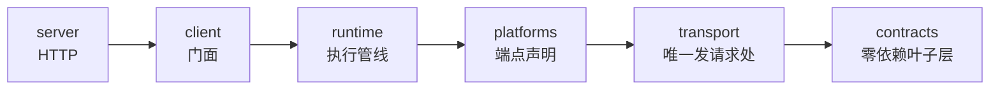

# 开始开发

本页只做两件事：把环境跑起来，然后告诉你接下来该读哪一页。

## 环境

| 要求 | 版本 |
| ---- | ---- |
| Node.js | ≥ 22 |
| pnpm | ≥ 9 |

```bash
git clone https://github.com/ikenxuan/amagi.git
cd amagi
pnpm install
```

## 仓库地图

pnpm workspace，六个包：

```files
amagi
├── packages
│   ├── core            # @ikenxuan/amagi —— 唯一发布物
│   ├── web             # 控制台（Vite + React + HeroUI）：录样本、生成类型的主入口
│   ├── typegen         # 响应类型生成器：本地样本 → 形状树 → TS 源码
│   ├── response-types  # 生成出来的响应类型，core 当 devDep 装、透给下游
│   ├── codemod         # v6 → v7 消费方改写工具（仓库内私有）
│   └── docs            # 本文档站（Fumadocs + Next）
├── corpus              # 录到的响应样本：只留本地、不进 git（seeds.json 与 *.doc.json 例外）
├── docs/v7             # v7 的设计文档与执行清单（不是本站内容）
└── skills              # 给 AI 代理的技能包
```

`packages/core/src/` 按职责分六层，依赖方向单向、由 CI 的 `dpdm` 钉住 0 环：



<Callout type="warn">
  `src/` 下同时存在 `platform/`（单数）与 `platforms/`（复数），**两个都是活的**：复数是 v7 实现层，
  单数是公开工具面与路由工厂。新增端点只碰复数。详见[端点注册表](/docs/v7/dev/internals/registry)。
</Callout>

## 常用命令

从仓库根跑：

| 命令 | 做什么 |
| ---- | ------ |
| `pnpm console` | **控制台开发模式**（`packages/web`）：填参 → 发请求 → 挑变体 → 就地生成响应类型。日常改接口从这里开始 |
| `pnpm dev` | 核心包开发模式（`tsx watch`） |
| `pnpm docs:dev` | 文档站开发模式，访问 http://localhost:3000 |
| `pnpm build` | 构建所有包 |
| `pnpm typecheck` | 六个包的类型检查（docs 那份还串了三道静态门） |
| `pnpm lint` / `pnpm fix` | oxlint 检查 / oxfmt 自动修复 |
| `pnpm test` | vitest 运行时用例 |
| `pnpm test:types` | 类型测试（`*.test-d.ts`，只有它能抓测试文件里的类型错） |
| `pnpm openapi` / `pnpm openapi:check` | 重新生成 / 校验 `openapi.json` |
| `pnpm gen:types` | 从本地 `corpus/` 生成响应类型，写进 `packages/response-types/src/generated/` |
| `pnpm types:check` | 校验那棵生成树。**一致性只有本地有样本时才验得了**，CI 上没样本 |
| `pnpm types:size` | 响应类型体积门禁，量手写与生成两棵树 |
| `pnpm deps:check` | dpdm 循环依赖检查，必须 0 环 |
| `pnpm build:docs` | 文档站整站构建（含 twoslash 求值与死链检查） |

提交前最少跑 `typecheck` + `lint` + `test`。动了端点声明还要 `openapi:check`，录了新样本要 `gen:types` 重跑并把 `packages/response-types/src/generated/` 一起提交（样本自己留本地），动了文档要 `build:docs` —— 这些都是 CI 的必需检查。命令的完整展开与 CI 各道门的判定条件见[仓库工程](/docs/v7/dev/internals/repo)。

## 我要做 X，该读哪一页

| 你要做的事 | 去哪 |
| ---------- | ---- |
| 给某个平台加一个数据接口 | [新增接口](/docs/v7/dev/add-api) |
| 先搞懂整体分层与依赖方向 | [项目架构](/docs/v7/dev/architecture) |
| 改执行管线、重试、错误归因 | [请求生命周期](/docs/v7/dev/internals/lifecycle) |
| 改签名、header、cookie、重试策略 | [传输与签名](/docs/v7/dev/internals/transport) |
| 加事件、查「为什么收不到事件」 | [事件与可观测性](/docs/v7/dev/internals/events) |
| 改翻页或扫码登录 | [翻页与会话](/docs/v7/dev/internals/session) |
| 改对外导出、`/compat`、HTTP 服务 | [公开 API 表面](/docs/v7/dev/internals/surface) |
| 改类型、信封、错误码 | [契约与信封](/docs/v7/dev/internals/contracts) |
| 提 PR、写提交信息 | [贡献指南](/docs/v7/dev/contributing) |

<Callout type="info">
  「内部机制」那一组是**写给 AI 代理和深度贡献者**的：逐子系统讲清特点与机制，比这几页详细得多。
  如果你在用 Claude Code、Cursor 之类的工具改 amagi，直接让它读[内部机制](/docs/v7/dev/internals)
  比让它猜源码结构快得多 —— 三条取用通路见 [AI 代理](/docs/v7/ai)。
</Callout>
