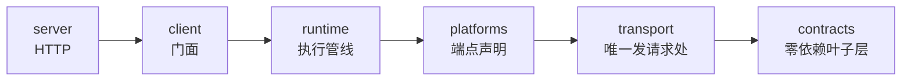

# 开始开发

本页做三件事：把环境跑起来、交代改完代码该跑什么、指路。逐子系统的机制不在这里 ——
那在[内部机制](/docs/v7/dev/internals)。

<Callout type="tip" title="建议把改动交给 Claude Code 或 Codex">
  这个仓库是**按 AI 代理能直接上手**来组织的：装一次技能包
  `npx skills add ikenxuan/amagi`，Claude Code、Codex 这类工具就知道端点声明怎么写、
  该跑哪几道门、提交信息长什么样 —— 不用先喂它一堆上下文。
  「加一个平台接口」「补一条响应样本」「重新生成类型」这类活尤其适合交出去，
  你只需要在收尾时自己跑一遍[合并前那条命令](#开发闭环)。
</Callout>

## 环境

| 要求 | 版本 |
| ---- | ---- |
| Node.js | ≥ 22 |
| pnpm | ≥ 9 |

```bash
git clone https://github.com/ikenxuan/amagi.git
cd amagi
pnpm install
```

安装期间 `@ikenxuan/amagi-response-types` 会跑自己的 `prepare` 完成构建 —— core 的类型解析
指到那个包的 `dist/index.d.ts`（`packages/core/tsconfig.json` 的 `paths`），它没构建过时
core 的类型检查会报一串「模块没有导出成员」，而不是指向真正的原因。

## 仓库地图

pnpm workspace，六个包：

```files
amagi
├── packages
│   ├── core            # @ikenxuan/amagi —— 唯一发布物（六层，见下）
│   ├── web             # 控制台（Vite + React + HeroUI）：录样本、生成类型的主入口
│   ├── typegen         # 响应类型生成器：本地样本 → 形状树 → TS 源码
│   ├── response-types  # 生成出来的响应类型，core 当 devDep 装、透给下游
│   ├── codemod         # v6 → v7 消费方改写工具（仓库内私有）
│   └── docs            # 本文档站（Fumadocs + Next）
├── corpus              # 录到的响应样本：只留本地、不进 git（seeds.json 与 *.doc.json 例外）
├── skills              # 给 AI 代理的技能包
└── .github/workflows   # CI：质量门禁与发版（release.yml）、文档站部署（pages.yml）
```

`packages/core/src/` 按职责分六层，依赖方向单向、由 CI 的 `dpdm` 钉住 0 环：



<Callout type="info">
  `platforms/` 是唯一的平台目录。它底下的 `platforms/legacy/` 是 **v6 保留实现**
  （公开工具集的实现来自那里），v7 的新代码一律进 `platforms/<平台>/`。
  详见[端点注册表](/docs/v7/dev/internals/registry)。
</Callout>

## 开发闭环

日常就是一个循环：**改一处 → 跑对应的门 → 提交**。门禁不止 `tsc` 一条 —— 这个仓库偏爱
「编译绿但产物是空壳」，每道门各自接住别的门碰不到的一类。

| 你改了什么 | 至少跑 | 为什么 |
| ---------- | ------ | ------ |
| `packages/core/src/` 任意源码 | `pnpm typecheck` `pnpm lint` `pnpm test` `pnpm deps:check` | 依赖方向由 dpdm 钉死（必须 0 环），调用行为由 vitest 钉死 |
| 端点声明（新增 / 改 `route` / 改 `doc`） | 上一行 + `pnpm openapi` 并提交产物 | `openapi.json` 是四个注册表的派生物，CI 与它逐字节比对 |
| 录了新响应样本 | `pnpm gen:types` → **重建 `response-types`** → 提交生成树 | core 的类型解析指到那个包的 `dist/`，不重建就还在读旧类型 |
| 测试或类型测试（`*.test-d.ts`） | `pnpm test` / `pnpm test:types` | `tsconfig` 的 `exclude` 不检查 `*.test.ts`，测试文件里的类型错只有 `test:types` 抓得到 |
| 文档站（`packages/docs/`） | `pnpm --filter=docs run typecheck` | 它串了 `<include>` 区段与侧边栏两道静态门，都在整站构建之前 |
| 控制台（`packages/web/`） | `pnpm --filter @ikenxuan/amagi-web run build` | 体积预算按产物量，三条线都写在 CI 那一步里 |

提交前全跑一遍 —— 与 CI 的质量门禁是同一套：

```bash
pnpm typecheck && pnpm lint && pnpm format:check && pnpm test && pnpm test:types \
  && pnpm openapi:check && pnpm deps:check && pnpm types:check
```

**`format:check` 是最常漏的一条**：它是 oxfmt，不是 oxlint，长期没有门禁、2026-09 才补上；
漏跑的表现是本地全绿而 CI 单独一步红。三条命令的分工是：`lint` 查、`format:check` 只检查、
`fix` 才改文件。

### 几条「红了，但不是你改坏了」

| 现象 | 真相 |
| ---- | ---- |
| `deps:check` 报十几条 dpdm warning | 恒定的第三方入口解析告警；**只有循环依赖才置非零**，目标 0 环 |
| `types:check` 在 CI 上「跳过比对」 | 样本不进 git，CI 上只验得了「barrel 与产物树一致」；「产物与证据一致」只有本地有 `corpus/` 时验得了，脚本明说跳过、不假装通过 |
| `test` 偶发两条 `bad port` | 内核给测试服务分到了一个 fetch 封禁端口，隔离重跑即绿，与改动无关 |

## 控制台：日常改接口的地方

`packages/web` 不只是录样本的工具 —— 想知道一个接口真实返回什么、有哪些变体，它是最快的路。

```bash
pnpm console     # 一条命令起 Node 侧 + 浏览器侧；任一侧退出会把另一侧一起收掉
```

左栏搜端点 → 填参（表单由端点声明的 zod schema 派生）→ 发送 → **三栏并排**看请求 / 响应 / 类型
→ 「留下 / 丢掉」→ 生成类型。cookie 在右上角抽屉里配，保存后写进仓库根的 `.env` 并立刻生效；
页面上一个字都不回显。`--host` / `--port` / `--token` 由 `pnpm console` 原样透传给 server 侧。

需要分两个终端时用 `pnpm console:server`（Node 侧）与 `pnpm console:web`（浏览器侧，Vite 把
`/api/*` 代理过去）—— **少起 Node 侧时每个请求都会失败，而且失败的样子会骗人**，见
[贡献指南的「corpus 工作流」](/docs/v7/dev/contributing#corpus-工作流)。

## 常用命令

从仓库根跑：

| 命令 | 做什么 |
| ---- | ------ |
| `pnpm console` | 控制台开发模式（上一节），日常改接口从这里开始 |
| `pnpm dev` | 核心包开发模式（`tsx watch`，`LOG_LEVEL=debug`） |
| `pnpm docs:dev` | 文档站开发模式：先建 core、再生成端点页，然后 `next dev`，访问 http://localhost:3000 |
| `pnpm build` | 构建所有包 —— **含文档站整站构建**，本机不一定跑得动（见下） |
| `pnpm typecheck` | 六个包的类型检查（docs 那份还串了三道静态门） |
| `pnpm lint` / `pnpm fix` / `pnpm format:check` | oxlint 检查 / oxfmt 自动修复 / 格式只检查不写盘 |
| `pnpm test` / `pnpm test:types` | vitest 运行时用例 / 类型用例（`*.test-d.ts`） |
| `pnpm openapi` / `pnpm openapi:check` | 重新生成 / 校验 `openapi.json` |
| `pnpm gen:types` / `pnpm types:check` | 从本地 `corpus/` 生成响应类型 / 校验那棵生成树 |
| `pnpm types:diff <生成产物> <手写类型>` | 手工工具：按**路径**比两棵树，不是门禁 |
| `pnpm deps:check` | dpdm 循环依赖检查，必须 0 环 |
| `pnpm build:docs` | 文档站整站构建（含死链检查） |

`build:docs` 是整站构建，CI 那台 4 vCPU / 16 GiB 的 runner 上跑（`next.config.mjs` 把 `cpus` 压到 2）。
**本机跑不动就交给 CI** —— 上面表里那条 `pnpm --filter=docs run typecheck` 已经把最常坏的
`<include>` 区段被改名挡在前面了，它只要有 TypeScript 就能跑，不需要 Next 的 bundler。

## 我要做 X，该读哪一页

| 你要做的事 | 去哪 |
| ---------- | ---- |
| 给某个平台加一个数据接口 | [新增接口](/docs/v7/dev/add-api) |
| 先搞懂整体分层与依赖方向 | [项目架构](/docs/v7/dev/architecture) |
| 写 / 改测试，或看不懂某条快照 | 仓库内 `packages/core/test/README.md`（布局、快照纪律、`KNOWN-DEFECT` 约定） |
| 改执行管线、重试、错误归因 | [请求生命周期](/docs/v7/dev/internals/lifecycle) |
| 改签名、header、cookie、重试策略 | [传输与签名](/docs/v7/dev/internals/transport) |
| 加事件、查「为什么收不到事件」 | [事件与可观测性](/docs/v7/dev/internals/events) |
| 改翻页或扫码登录 | [翻页与会话](/docs/v7/dev/internals/session) |
| 改对外导出、`/compat`、HTTP 服务 | [公开 API 表面](/docs/v7/dev/internals/surface) |
| 改类型、信封、错误码 | [契约与信封](/docs/v7/dev/internals/contracts) |
| 验一份签名实现到底对不对 | [签名验证](/docs/v7/dev/sign-verify) |
| 提 PR、写提交信息 | [贡献指南](/docs/v7/dev/contributing) |

## 本节内容

<DocsCategory />

<Callout type="info">
  「内部机制」那一组是**写给 AI 代理和深度贡献者**的：逐子系统讲清特点与机制，比这几页详细得多。
  直接让 AI 代理读[内部机制](/docs/v7/dev/internals)比让它猜源码结构快得多 ——
  三条取用通路见 [AI 代理](/docs/v7/ai)。
</Callout>
