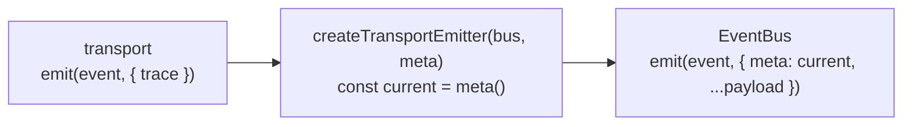

# 事件与可观测性

v6 的事件系统有两个结构性问题：总线是**全局单例**（一个进程共用一条），事件负载里**没有任何关联 id**（多实例并发时监听器分不清事件来自谁）。v7 的对应变化就是这一页的主题。

但有个坑必须先说：**仓库里现在有两套事件系统并存**，名字相近、都在公开导出面上。

## 先分清两套总线

| | v7 实例级 | v6 全局单例 |
| --- | --- | --- |
| 实现 | `runtime/events.ts` 的 `EventBus` | `model/events.ts` 的 `TypedEventEmitter` |
| 拿到它 | `client.events` / `client.on` / `client.once` | `amagi.events` / `amagi.on` / `amagi.once`，或导出的 `amagiEvents` |
| 作用域 | 每个 `createClient()` 一条，实例间互不串扰 | 整个进程一条 |
| 负载带关联 id？ | **带**（`meta.requestId` / `clientId`） | **不带**（只有 `timestamp`） |
| 事件名 | 15 个 | 12 个 |
| 谁在写它 | v7 管线（execute / transport / session） | `transport/legacy.ts`、抖音 passport、`/compat` 的迁移提示 |

<Callout type="warn">
  `amagi.events` 与 `client.events` **不是同一个对象**。`amagi.events === amagiEvents`（v6 单例），
  而 `createClient().events` 是新建的实例级总线。想收 v7 管线的事件必须用后者 ——
  监听 `amagi.on(...)` 收不到任何 v7 事件。有测试专门断言 `first.events !== second.events`。
</Callout>

v6 那套的现状被三条 KNOWN-DEFECT 用例钉住（负载无关联 id、`http:*` 声明了却从不触发、自由函数写全局单例），并进了快照。它仍是公开导出，所以不能悄悄删。

## 实例级总线怎么接起来的

`createClient` 里 `createEventBus('client')` 造一条，然后同时做三件事：

1. 作为 `client.events` 暴露，`on` / `once` 是它的绑定方法；
2. 逐平台传进 `makeClientCtx` 的 `assembly.bus` → `ctx.bus` 让 `execute` 能发 `api:*`；
3. `ctx.scope` 在每次调用时把 `createTransportEmitter(bus, meta)` 装进那一次的 `HttpClient` → `http:*` / `network:*` / `log:warn` / `log:error` 才真的发出去。

**三根线缺一根就等于没接。** 这曾经是一个真实缺陷：槽位定义在一头、装配方在另一头，中间没人对得上，于是 `client.events` 收不到任何东西。现在装配收成一个具名的 `CtxAssembly` 对象而不是继续加位置参数，就是为了让「有槽位没人装」这件事看得见。

只有 `createClient` 传 `assembly`。静态 fetcher、bound fetcher、HTTP 路由都不传 —— 那三条路径一个事件都不发。

## 15 个事件

事件名常量分两组：12 个与 v6 逐名对齐，3 个是 v7 独占的 `session:*`。

| 事件 | 负载 | 触发点 |
| ---- | ---- | ------ |
| `http:request` | `meta` + `trace` | transport 登记 trace 之后立刻 |
| `http:response` | `meta` + `trace` | 拿到响应 / 决定重试 / 彻底失败，**三处都发** |
| `http:error` | + `status` | 仅当 `status` 存在且非 2xx |
| `network:retry` | + `code` / `errno?` / `status?` / `attempt` / `maxRetries` / `delayMs` | transport 决定重试时 |
| `network:error` | + `code` / `errno?` / `message` / `attempts` | transport 彻底失败时 |
| `log:warn` | `LogEvent` | 随 `network:retry` 顺带发一条人话 |
| `log:error` | `LogEvent` | 随 `network:error` 顺带 |
| `log:mark` | `LogEvent` | `startServer` 开始监听时（注入了自定义 `listen` 时**不发**） |
| `api:success` | `meta` + `data` | `execute` 返回成功信封前 |
| `api:error` | `meta` + `error` | `execute` 返回失败信封前 |
| `session:state` | `SessionStateEvent` | 会话取到码、每次轮询有结果、超时那条 |
| `session:error` | `SessionErrorEvent` | 轮询失败 / 应答失败 / abort / 无 `onChallenge` / 终态 |
| `session:success` | `SessionSuccessEvent` | `watch` 拿到 credential |
| `log:info` | `LogEvent` | **实例总线上没有 emit 点** |
| `log:debug` | `LogEvent` | **实例总线上没有 emit 点**（v6 单例上还有） |

最后两个不是漏了写文档 —— 仓库里有一个 `UNEMITTED_BUS_EVENT_NAMES` 常量把它们列出来，并有测试钉住「这两个事件名可订阅但当前无触发点」。想加 emit 点得先改那个常量，否则测试会红。

`network:retry` 顺带发的那条 `log:warn` 文案与 v6 遗留路径的**逐字一致**：

```
网络请求失败 [<errno 或 HTTP xxx>]，<delayMs>ms 后进行第 <attempt> 次重试...
```

## meta 是在出口惰性补上的

transport 层**不能**反向依赖 runtime（依赖方向是 `contracts ← transport ← runtime`），所以它发出的负载里没有 `meta`。补 `meta` 发生在 `createTransportEmitter` 这个出口函数里：



`meta()` 是闭包，每次调用现算 `durationMs` 与 `attempts`。所以两条 `http:request` 事件上的 `attempts` 依次是 `1`、`2` —— 有测试直接断言这个序列，它同时证明了惰性求值和「一次调用共享一个 `requestId`」。

## debug 不影响事件发射

这是最容易搞错的一处。`ClientOptions.debug` 只做两件事，都不涉及事件：

1. 失败信封多一个 `error.raw`（原始响应）；
2. 信封的 `meta.trace` 带每次底层请求的明细。

**trace 的计数与 `http:*` 负载里的 `trace` 与这个开关无关** —— 登记与计数始终发生，`debug` 只决定明细是否随信封带出。也没有独立的 trace 开关：`trace` 与 `error.raw` 是同一个开关，这是刻意的（此前「开 debug 才填 raw / 开 trace 才填明细」是两句空话，因为没人设过它们）。

关闭时这两个键**根本不存在**，不是 `undefined` —— 与信封「运行时形状与声明一致」是同一条纪律。

## 会话事件用的是另一套 id 空间

会话引擎自己造 `session-<base36>-<rand>` 形式的 id，`clientId` 固定 `'session'`，而且 `durationMs` 与 `attempts` **恒为 0**。它与 fetcher 的 `requestId` 空间不相交，也没有 `trace`。

会话期间的底层请求**不发** `http:*` / `network:*`：会话用的 HttpClient 虽然建了 trace 收集器，但没有注入 `emit` 出口。想观测扫码登录的网络细节，目前只能靠 `session:*` 三个事件。

## 还有一条零消费者的全局总线

`runtime/events.ts` 里另有一个 `defaultEventBus = createEventBus('global')`，源码注释自己写着「生产代码零消费者」。它既不是 v6 那个 `amagiEvents`，也没有人订阅 —— 读代码时看到它不用找它的用途。

## 实际用法

面向下游的订阅示例与完整负载类型见[事件系统](/docs/v7/usage/guide/events)。这里只给一条本页的结论性提醒：

```ts twoslash
import amagi from '@ikenxuan/amagi'

const client = amagi({ cookies: { bilibili: '' }, debug: true })

// 对：实例级总线，收 v7 管线的 15 个事件
client.on('api:error', ({ meta, error }) => {
  console.log(meta.requestId, meta.attempts, error.kind)
})

// 错：这是 v6 全局单例，收不到 v7 管线的事件
amagi.on('api:error', () => {})
```
