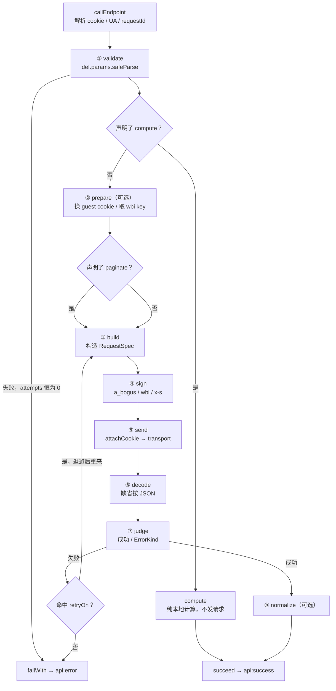

# 请求生命周期

四个入口，**一条管线**。理解了这一页，四个入口的差异就只剩「装了哪些可选能力」。

## 四个入口收敛到一处

| 入口 | `meta.clientId` | 事件总线 | `debug` |
| ---- | --------------- | -------- | ------- |
| `createClient({...}).<平台>.fetcher.<方法>(options, requestConfig?)` | `client-1` | **有** | **可开** |
| `amagi.<平台>Fetcher.<方法>(options, cookie?, requestConfig?)`（静态） | `static-<平台>` | 无 | 无 |
| `createBound<平台>Fetcher(cookie, requestConfig?)` | `bound-<平台>` | 无 | 无 |
| `startServer()` 挂的 `/api/<平台>/*` | `routes-<平台>` | 无 | 无 |

四者都进 `client/fetcher.ts` 的 `callEndpoint` → `runtime/execute.ts` 的 `execute`。差异全部来自 `makeClientCtx` 的第五个参数 `assembly`：只有 `createClient` 传了 `{ bus, debug }`，其余三个入口不传，于是 `ctx.bus` 是 `undefined`，整条链路一个事件都不发、失败信封没有 `error.raw`、`meta` 没有 `trace`。

<Callout type="info">
  这不是遗漏而是取舍：静态 fetcher 的签名是 v6 冻结的三参形式，没有装总线的位置。
  **要观测就用 client 形态。**
</Callout>

## 九个阶段

`ExecuteStage` 共 9 个取值，它同时是异常归因的依据 —— 任何一处抛出都会被标上当时的阶段名。

逐阶段的关键事实：

1. **`validate`** —— `def.params.safeParse(input)`。失败即 `kind: 'validation'` / `code: 'PARAM_INVALID'`，`message` 取第一条 issue 的文案，`issues` 全带。此时 **`attempts === 0`**，一个请求都没发出去。
2. **`compute` 短路** —— 声明了 `compute` 就直接返回成功信封，跳过 prepare / build / sign / send。全仓仅 B站 AV↔BV 两个端点。
3. **`prepare`** —— 返回值浅并进 ctx，因此它可以换掉 `ctx.cookie`。它内部的请求经 `ctx.send(..., 'prepare')`，在 trace 里以 `reason: 'prepare'` 出现。
4. **翻页分支排在首次 build / sign 之前** —— 顺序是刻意的：反过来会白签一次名。
5. **`build`** —— 返回数组即多请求；空数组直接抛。
6. **`sign`** —— 签名器解析在此之前完成：字符串查平台签名器表，**查不到就抛**（`未注册的签名器：'x'`，归因为 `internal`）。
7. **`send`** —— `attachCookie` 在这里把 `ctx.cookie` 写进 `Cookie` 头：cookie 非空、且 spec 尚未自带 cookie 头时才写。取的是**当刻**的值，所以 prepare 换过就发换完的。
8. **`decode`** —— `def.decode(res.body, res)`，缺省直接用 `res.body`。
9. **`judge`** —— `judge(decoded, { status })`，缺省是「HTTP 2xx 即成功」。判定失败时 `kind` / `code` 来自 judge，而 `platform.code` 与 `message` 由 runtime 统一从原始响应里提取（依次试 `code` / `status_code` / `statusCode`，`message` / `status_msg` / `msg`）。
10. **`normalize`** —— 把响应裁剪 / 整形为声明的返回类型。多分片时它收到的是数组。

## 永不 reject：唯一一处 catch

`execute` 全函数只有**一个** `catch` 子句，它把任何抛出物按当时的 `stage` 归类：

- `TransportError` → 用它自带的 `kind` / `code` / `errno`
- `stage === 'decode'` → `kind: 'parse'` / `code: 'DECODE_FAILED'`
- 其余 → `kind: 'internal'` / `code: 'INTERNAL_ERROR'`，message 带阶段名，`cause` 原样保留

于是对外承诺成立：**参数校验失败、平台业务错误、网络错误、内部异常全部映射为 `success: false`，管线永不 reject**。

这条约束是被源码级测试钉住的 —— 用例直接断言 `execute.ts` 里 `catch` 子句恰好一处、且没有 `.catch(`。想加第二处 catch 会让测试红。

<Callout type="warn">
  这是相对 v6 的**行为变化**：v6 里参数校验失败会 `throw`，v7 不再进 `catch`。
  依赖 `try/catch` 捕获校验错误的 v6 代码在 v7 下会静默走进成功分支的 `else`。
  需要恢复抛出语义时用 [`/compat`](/docs/v7/dev/internals/surface)。
</Callout>

## meta：一次调用的可观测账本

每个信封与每条事件负载都带 `meta`：

<auto-type-table path="../../../../../../core/src/contracts/meta.ts" name="AmagiMeta" />

三个容易误解的点：

**`requestId` 一次调用只有一个。** 它在 `callEndpoint` 最开始生成，随 `metaOf` 闭包一路带到 transport 的事件出口。所以一次「翻 3 页 + 重试 1 次」的调用里，4 条 `http:request` 事件与最后那条 `api:success` **共享同一个 `requestId`**。

**`attempts` 数的是底层请求数，不是重试数。** 它恒等于 trace 登记的条数，而登记发生在每次 `HttpClient.send` 之前 —— 与 `debug` 无关。所以：单请求成功 = 1；翻 3 页 = 3；翻 3 页其中一页重试一次 = 4；校验失败 = 0。

**`durationMs` 与 `attempts` 是惰性算的。** `metaOf()` 每次调用都用 `now() - startedAt` 与 `tracer.attempts` 现算，所以事件负载里看到的是**那一刻**的值。有测试断言两条 `http:request` 事件上的 `attempts` 依次是 `[1, 2]`，正是这个惰性的证据。

`trace` 只在 `debug: true` 时才有键（不是 `undefined`，是**键不存在**）。每条 trace 记录带 `reason`，五个取值：`initial`（首次）/ `retry` / `page`（翻页）/ `segment`（分段并发）/ `prepare`（前置请求）。

## 两层重试是串联的

这一点直接决定最坏情况的请求数，容易低估：

| 层 | 触发条件 | 次数 | 退避 |
| -- | -------- | ---- | ---- |
| **transport 层** | 可恢复 errno（9 个白名单）、HTTP 429、HTTP ≥500 | 最多 3 次重试 | 1s / 2s / 4s（`base × 2^(n-1)`） |
| **端点层 `retryOn`** | judge 判定的 `error.code` 在声明的列表里 | 最多 3 次重试 | 同一套退避函数 |

两层独立叠加，理论上一次调用最多 `4 × 4 = 16` 个底层请求。`meta.attempts` 会如实反映 —— 这正是设计意图：v6 的重试叠乘问题不可见，v7 把它变成一个能读的数字。

### `retryFresh`：重试时换一整套参数

端点层重试**默认是原样重放**同一个 `RequestSpec`。B站的 `-412` 只需要等一会儿再发同一个请求，重放就够了。

抖音不行：Argus 是**按单次请求的 token 组判定、不锁账号**的，同一个 `msToken` + 同一个 `a_bogus` 重发三次结果必然相同。所以 `EndpointDef` 上有 `retryFresh?: boolean` —— 打开之后重试会**重新 `build`（新 `msToken`）+ 重新 `sign`（新 `a_bogus`）**。17 个签名类抖音端点声明了 `retryOn: ['ANTIBOT_PAGE'] + retryFresh: true`。

按**原来的分片下标**取重建后的那一条，所以多请求聚合 / 分段并发的端点也能用：失败的那一段单独换参重来，不影响其他段。

<Callout type="warn">
  **`retryFresh` 刻意是 opt-in 而不是默认。** 快手那类带可变状态的签名器会因为多签一次
  被推进一格 —— 同一条理由让翻页分支必须把 build 排在首次签名之前。
</Callout>

## `observe`：从响应头回收平台状态

`send` 拿到响应之后、`decode` 之前，管线会调一次平台级的 `observe(res, ctx)`。它**只读、不影响判定**，与 `challenge` 一样挂在 `PLATFORM_RUNTIME` 上，三个入口（client fetcher / 静态 fetcher / HTTP 路由）都有。

目前只有抖音装了它，用来回收 `webid`：那个值是服务端按 `ttwid` 算好、通过每个响应的 `cookie_ttwidinfo_webid` 头下发的，**客户端算不出来**。抖音会拿 query 里的 `webid` 与 cookie 会话交叉校验，对不上就静默回 HTTP 200 + 0 字节（不给 403、不给业务码）—— 所以缓存按 `ttwid` 分键，冷启动第一次不带（不带是安全的，传错才致命）。注入发生在签名管线的第一步：`webid → a_bogus / x_bogus → secsdk`。

<Callout type="warn">
  `observe` 的实现方必须**自己吞异常**。它抛出来会被管线唯一那处 catch 归因成
  `kind: 'internal'`，把一个本来成功的调用变成失败 —— 旁观者不该有这个权力。
</Callout>

<Callout type="info">
  客户端侧**没有**令牌桶、并发闸或 QPS 限制。限频只表现为「429 进退避重试并发出
  `network:retry` 事件（`code: 'RATE_LIMITED'`）」。多请求聚合（快手用户主页 12 并发、
  抖音弹幕按 32 秒切段）是无节流的 `Promise.all` / `allSettled`。
</Callout>

## 多请求与部分失败

`build` 返回数组时，`signed.length > 1` 即进入多分片模式，trace 上的 `reason` 变成 `segment`：

- **`partial: 'tolerate'`** —— 用 `Promise.allSettled`，个别分片失败时缺失部分留空。注意**全部分片失败仍然返回失败信封**。选 `allSettled` 而不是 try/catch 是为了不引入第二处 catch。
- **缺省 `'fail'`** —— 用 `Promise.all`，任一分片失败即整体失败。

翻页分支里 `partial` 被忽略。

## 阶段与异常的对应关系有测试逐个覆盖

`test/runtime/execute.test.ts` 在每个环节各抛一次，验证「永不 reject」；另有专项用例验证 `TransportError` 归 `network` 而非 `internal`、未注册的签名器名归 `internal`。改动管线时这些用例是第一道防线。

## 下一步

- 请求真正发出去之后的事：[传输与签名](/docs/v7/dev/internals/transport)
- 这一路发了哪些事件：[事件与可观测性](/docs/v7/dev/internals/events)
- 翻页那条虚线的细节：[翻页与会话](/docs/v7/dev/internals/session)
