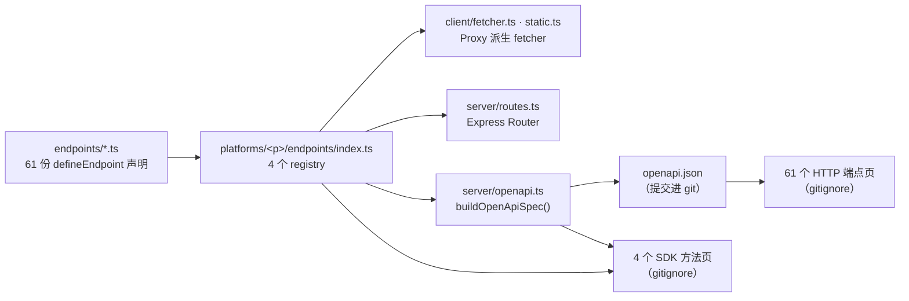

# 端点注册表

amagi v7 的全部设计压力都集中在一件事上：**一个平台接口只写一次**。

v6 的做法是同一个接口在 11–15 个文件里各写一份（参数类型、校验 schema、URL 构造、fetcher 方法、路由、返回类型、文档），任意两份之间的不一致都能独立发生。v7 把它收成一份 `defineEndpoint` 声明，其余一切**派生**。

这一页讲清派生链路的每一环：声明里有什么、谁在读它、读出来变成什么。

## 声明本体

契约在 `contracts/endpoint.ts`：`EndpointDef` 是形状，`defineEndpoint` 是构造器（**运行时是恒等函数**，全部价值在类型推导），`type<T>()` 是只承载类型的响应令牌（运行时返回空对象）。

必填四项 —— `name` / `route` / `params`，以及类型上可选但 CI 强制的 `doc`。最朴素的一个端点长这样：

<include lang="ts" meta='title="packages/core/src/platforms/douyin/endpoints/videoWork.ts"'>../../../../../../core/src/platforms/douyin/endpoints/videoWork.ts</include>

| 字段 | 类型 | 它导致什么 |
| ---- | ---- | ---------- |
| `name` | `` `${Platform}.${string}` `` | `meta.endpoint`；OpenAPI 的 `operationId`（`平台_短名`）与 `tags`（取平台段）。**声明里没有 `tags` 字段** —— 平台就是 tag |
| `route` | `string` | HTTP 路径，**同平台内必须唯一**（注册期同步校验，重复直接抛） |
| `params` | zod schema | 参数 TS 类型（`InputOf` / `ParsedOf`）、运行时校验、OpenAPI 的 query parameters、文档参数表 —— 四样东西的**唯一出处** |
| `doc.summary` | `string` | OpenAPI `summary`、SDK 方法页的首句。类型可选，测试强制（见下） |
| `build` | `(params, ctx) => RequestSpec \| RequestSpec[]` | 构造请求描述。返回数组即多请求聚合 / 分段并发 |
| `sign` | `string \| false \| SignFn` | 字符串查平台签名器表；`false` 显式不签；函数即一次性签名器 |
| `response` | `type<T>()` | `TData` 的主要来源。声明了 `normalize` / `compute` 时会被它们的返回类型覆盖，所以那两个钩子**必须显式标注返回类型** |

字段全貌用源码渲染，避免与实现漂移：

<auto-type-table path="../../../../../../core/src/contracts/endpoint.ts" name="PaginateDef" />

### 可选槽位与它们的真实使用量

每个可选槽位对应一种非常规端点形态。下表的「用它的端点数」是当前仓库的实际统计 —— 它同时告诉你哪些槽位是主干、哪些是个别特例：

| 槽位 | 端点数 | 做什么 |
| ---- | ------ | ------ |
| `retryOn` | 25（24 在 B站） | 命中这些错误码时端点级重试。B站的 `-412` → `RISK_CONTROL`；快手弹幕约 13% 概率的 `result: 11` → `PLATFORM_UNAVAILABLE` |
| `paginate` | 10 | 声明式翻页，见[翻页与会话](/docs/v7/dev/internals/session) |
| `decode` | 3 | 响应不是普通 JSON：protobuf（B站弹幕）、multi-JSON（抖音搜索）、HTML（小红书用户页） |
| `judge` | 3 | 覆盖平台默认判定 |
| `partial` | 3 | 多请求部分失败语义：`'tolerate'` / `'fail'`（缺省） |
| `compute` | 2 | 纯本地计算，不发请求（B站 AV/BV 互转） |
| `sign: false` | 2 | 显式不签名（抖音表情列表、搜索） |
| `prepare` | 1 | 前置请求。唯一一处是小红书 `homeFeed`：cookie 里没有 `a1` 就先换游客 cookie |

`toCanonical` 是留给后续阶段的空槽位，v7 里类型恒为 `undefined`。

## 注册表

四个平台各一份 `endpoints/index.ts`，把声明组装成对象字面量，键是**端点短名**：

<include lang="ts" meta='title="packages/core/src/platforms/douyin/endpoints/index.ts（节选）"'>../../../../../../core/src/platforms/douyin/endpoints/index.ts#docs-registry</include>

`Registry = Record<string, AnyEndpointDef>`。平台清单是 `contracts/platform.ts` 的 `PLATFORMS`，`Platform` 联合类型由它推导。

当前规模 —— 抖音 19、B站 27、快手 8、小红书 7，**合计 61**。这个数字在七个地方被断言，改了端点数就得同步（见[新增接口](/docs/v7/dev/add-api)）。

<Callout type="info">
  注册表**不在包的公开导出面上**：`src/index.ts` 没有 `export * from './platforms'`，`package.json`
  的 `exports` 也没有 `./platforms` 子路径。它只以派生物的形态对外 —— 下游拿到的是 fetcher 方法、
  HTTP 路由与类型，碰不到 registry 本身。
</Callout>

## 派生出什么

| 派生物 | 生成器 | 输入 | 产物进 git？ |
| ------ | ------ | ---- | ------------ |
| fetcher 方法集合 | `client/fetcher.ts`、`client/static.ts` | registry | 运行时 Proxy，无产物 |
| 参数校验 | `runtime/execute.ts` 的 `validate` 阶段 | `def.params` | 无 |
| HTTP 路由 | `server/routes.ts` 的 `createRoutes` | registry | 无 |
| OpenAPI 规范 | `server/openapi.ts` → `scripts/gen-openapi.mts` | 四个 registry | **提交**（`packages/core/openapi.json`，61 条 path） |
| 自托管 `/openapi.json` | `server/auth.ts` 的 `mountOpenApiSpec` | 同上，**现算** | 无 |
| 61 个 HTTP 端点页 | `packages/docs/scripts/generate-docs.ts` | `openapi.json` | gitignore |
| 4 个 SDK 方法页 | 同上 | registry 本体 + `buildOpenApiSpec()` | gitignore |
| SDK 方法名 | **手写表** `client/method-names.ts` | — | 提交 |

### fetcher 是 Proxy，不是预生成对象

`createFetcherFromRegistry` 返回一个 Proxy：`get` / `ownKeys` / `has` / `getOwnPropertyDescriptor` 全部按**当前 registry** 现算，命中后造闭包并缓存。所以方法集合自动跟随注册表，`Object.keys(client.douyin.fetcher)` 与 `'fetchVideoWork' in ...` 都同步 —— 不存在「加了端点但方法没出现」这种状态。

绑定形态的方法签名是 `(options, requestConfig?)`；静态形态是 v6 冻结的三参 `(options, cookie?, requestConfig?)`。

### 方法名是唯一的手写映射

`client/method-names.ts` 有 61 条 `'<平台>.<短名>' → v6 方法名` 的映射。它存在是因为有 16 处不规则命名，拼不出来：

| 端点短名 | v6 方法名 |
| -------- | --------- |
| `parseWork` | `parseWork`（没有 `fetch` 前缀） |
| `comments` | `fetchWorkComments` |
| `search` | `searchContent` |
| `avToBv` | `convertAvToBv` |
| `videoStream` | `fetchVideoStreamUrl` |
| `danmaku`（快手） | `fetchDanmakuList`（与抖音的同名方法对齐） |

其余 45 条按 `fetch` + 短名首字母大写的规则派生，运行时与类型层都有同款兜底。

<Callout type="warn">
  兜底规则的存在**不代表**新端点可以不登记。两处会红：`generate-docs.ts` 在
  `methodNamesOf(platform)[short]` 为 `undefined` 时直接抛（于是 `pnpm build:docs` 失败，
  而它是 CI 必需检查）；`method-names.test.ts` 把映射表的方法名集合与**活 fetcher 的键**
  逐条比对，多一个就失败。所以规则名也必须登记。
</Callout>

### OpenAPI 的派生规则

`buildOpenApiSpec()` 遍历四个 registry：

- `paths` = `` `/api/${platform}${def.route}` ``，重复即抛
- 方法只有 `get`
- `parameters` = `zod.toJSONSchema(def.params, { io: 'input' })`，**全部落在 query**
- `operationId` = `` `${platform}_${short}` ``；`tags` = `[platform]`
- `summary` 缺失即抛
- `responses` 只有 200 与 401；`data` **不展开**（v6 的 ReturnDataType 有两万多行，展开会让规范爆炸）

序列化只有一种形式：2 空格缩进 + 末尾换行。`pnpm openapi:check` 把已提交的 `openapi.json` 归一化换行后**逐字节**比对，不一致即非 0 退出 —— 这是 CI 的必需检查之一。同一份 `buildOpenApiSpec` 还被单测拿来跟产物比对，所以 `pnpm test` 也能抓到「忘了重新生成」。

### 文档站的两批生成物

`packages/docs/scripts/generate-docs.ts` 在 `next build` / `next dev` / `typecheck` 之前跑（`docs:api`），先 `rm` 再生成：

- **HTTP 59 页** —— `fumadocs-openapi` 的 `generateFiles`，输入是 `openapi.json`，`per: 'operation'` + `groupBy: 'tag'`。`beforeWrite` 钩子补中文标题、平台图标，并追加一份自拼的索引页。
- **SDK 4 页** —— 遍历 registry，方法名取 `methodNamesOf`，参数表从 `buildOpenApiSpec()` 的 JSON Schema 生成（与 HTTP 侧同一个函数，所以两边的参数表不可能互相矛盾），`doc.summary` 进首句，`doc.deprecated` 变 Callout，`paginate` 变翻页说明，`compute` 变「纯本地计算」。手写散文只有一份 `content/partials/sdk-prose.mdx`，按区段 `<include>` 进来。

示例代码里的**取值**是唯一写死的东西（生成器里一张 `SAMPLES` 表），且取值与 schema 类型不符时直接抛 —— 参数改了型，示例会让构建红。

## 两个 platform 目录

`packages/core/src/` 下有 `platform/`（单数）与 `platforms/`（复数）两个目录，名字只差一个字母。**两个都是活的，职责不同**，这是读这个仓库最容易走错的一处。

| | `platforms/`（复数） | `platform/`（单数） |
| --- | --- | --- |
| 规模 | 99 文件 / 8741 行 | 39 文件 / 6034 行 |
| 是什么 | **v7 实现层** | v6 目录名下的**公开工具面 + 路由工厂** |
| 内容 | `endpoints/`（59 份声明 + registry）、`api.ts`（URL 构造纯函数）、`config.ts`、`judge.ts`、`sign/`、`session/`、`decode/`、`assemble/` | `routes.ts`（四个路由工厂）、`index.ts`（`xxxUtils` 工具集）、v6 版 `API.ts` 与 `sign/`、`douyin/passport/` |
| 在公开导出面上？ | **不在** | **在** —— `src/index.ts` 有 `export * from './platform'` |
| 新增端点要碰吗 | 要 | 不要 |

单数目录里的四个 `createXxxRoutes(cookie, requestConfig?)` 是**唯一**的路由挂载路径（门面 `startServer` 只认它们），内部完全走 v7：`createRoutes(platform, registry, makeClientCtx(...))`。也就是说单数目录承载的其实是 v7 的公开面，只是还挂在 v6 的目录名下。

它还提供 `amagi.douyin.douyinApiUrls` 这类工具集 —— 注意这与 SDK 内部实际发请求用的 URL 构造器（复数目录的 `api.ts`）**是两份代码**，两边行数不同。要改 URL 行为时必须确认自己改的是哪一份。

<Callout type="info">
  从 `src/index.ts` 递归跟随 import，两个平台目录共 144 个 `.ts`，**144 个全部可达**。

  这里曾经有 7 个不可达文件（`platforms/kuaishou/judge.ts` 与 `platforms/kuaishou/sign/` 下 6 个），
  成因是 `PLATFORM_RUNTIME` 里 `kuaishou: {}` —— 既没装签名器也没装默认 judge，写好的代码没人调用。
  两项都补上之后它们全部可达，那也正是快手请求终于带上 `__NS_hxfalcon` 的同一件事，
  见[传输与签名](/docs/v7/dev/internals/transport)。

  这个数字值得偶尔重算一遍：**「文件存在」不等于「被调用」**，而这个仓库已经因此踩过两次
  （judge 与 signers 各一次，都是既不报编译错误也不挂测试的静默漏项）。新加的
  `platforms/kuaishou/captcha.ts` 就是靠这次重算才发现忘了从顶层导出 —— 那会让「把滑块地址
  交给调用方」变成一句空话。
</Callout>

## `doc` 字段为什么被测试而不是类型强制

`doc` 在 `EndpointDef` 上是可选的，这样已有端点一个不改也能编译。真正的强制在 `test/contracts/endpoint-doc.test.ts`：拿四个注册表逐个断言 `doc.summary` 非空、≤40 字、不以句号结尾、同平台内不重复。

这是这个仓库反复使用的一种手法 —— **能用类型表达的用类型，不能的用测试钉住**，两者都不做的约定等于不存在。
