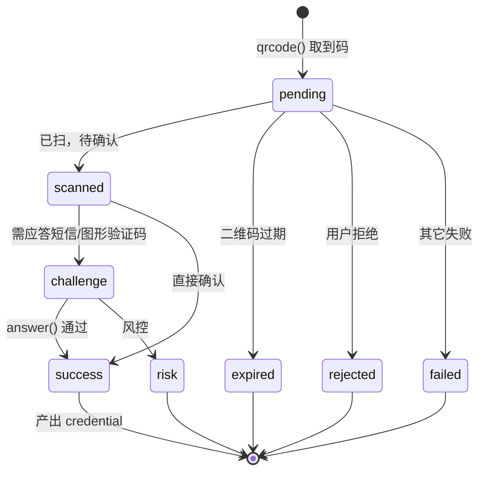

# 翻页与会话

两种「一次调用对应多次网络往返」的机制。翻页是**无状态的**，写在端点声明里；会话是**有状态的**，不是端点。

## 声明式翻页

端点声明里的 `paginate` 槽位。执行在 `runtime/paginate.ts`，它**不 catch 任何异常**（唯一的 catch 在 `execute`）。

### 算法

```
limitKey = limitParam ?? 'number'          // 读「想要多少条」的参数名
countKey = countParam ?? limitKey          // 写「本页要多少条」的参数名
target   = resolveTarget(params[limitKey], maxPageSize)   // 循环外算一次

while (collected.length < target):
    pageSize = min(target - collected.length, maxPageSize)   // 逐页收窄
    pageParams[countKey] = pageSize
    page = runPage(pageParams, isFirst ? 'initial' : 'page')
    失败 → 立刻返回该错误
    items(page) 非空数组 → 累积
    !hasMore(page) → break
    本页 items 非数组或为空 → break
    pageParams = nextParams(pageParams, page)

return { lastPage, pages, items: collected.slice(0, target) }
```

四个容易忽略的细节：

- **`resolveTarget`** 对非有限数回退到 `maxPageSize`，负数归 0，其余 `Math.trunc`。`number: 0` 意味着**一个请求都不发**，`lastPage` 是 `undefined`。
- **page-size clamping 包含第一页** —— `pageSize` 写回 `countKey` 是在循环内每轮都做，不是只在后续页做。
- **停止条件顺序固定**：先 `hasMore`，再「本页 items 为空」。
- **没有最大页数上限**，只靠上面两个条件收敛。目标条数是唯一的硬边界。

`execute` 侧：翻页分支排在首次 build / sign **之前**，每页回调里重新 `build` 并**重新 `sign`**，再走 send / decode / judge / `retryOn`。所以 `meta.attempts` = 页数 + 各页重试数，第 2 页起 trace 的 `reason` 是 `page`。

### 10 个端点的共同约定

当前 10 个用 `paginate` 的端点有三条一致的做法，读任何一个都能推到其余：

1. **全部省略 `limitParam` / `countParam`** —— 读写都用 `number`。
2. **全部声明 `normalize`，且只解构 `{ lastPage, items }`** —— 没有一个读 `pages`。
3. **全部没有声明 `partial`** —— 翻页分支里 `partial` 本来也被忽略。

`normalize` 的产出形状统一是「最后一页的浅拷贝 + 跨页聚合后的 items 塞回列表字段」。所以**调用方看到的不是分页结构，而是平台原始形状**：

| 平台端点 | maxPageSize | items 字段 | hasMore 判据 |
| -------- | ----------- | ---------- | ------------ |
| 抖音 评论 / 评论回复 | 50 / 3 | `comments` | `has_more === 1` |
| 抖音 三个列表类 | 18 | `aweme_list` | `has_more === 1`，但 `userRecommendList` 是**布尔** `=== true` |
| 抖音 搜索 | 15 | `user_list` 或 `data` | `has_more !== 0`（`undefined` 也算有更多） |
| B站 评论 | 100 | `data.replies` | `cursor.is_end !== true` |
| 快手 评论 / 用户作品 | 50 / 12 | 嵌套三层 | `pcursor` 非空串 |
| 小红书 笔记评论 | 50 | `data.comments` | `data.has_more === true` |

B站评论是唯一带**去重 + 二次截断**的（按 `rpid` 去重后再按 `params.number` 截断）。快手用户作品是唯一不做「最后一页浅拷贝」而是重建扁平结构的。

没有「共几页」「是否还有更多」之类的分页元信息透出给调用方 —— 想知道实际发了几个请求看 `meta.attempts`。

### 中途失败：已取到的数据全部丢弃

任一页失败，`runPaginated` 立刻返回该错误，`execute` 转成失败信封。**没有部分成功语义** —— 前几页已经拿到的数据不会带出来。

<Callout type="warn">
  **快手两个翻页端点的游标写不进请求。** `nextParams` 产出的 `pcursor` 在 `build` 里没有落点：
  快手评论的 graphql variables 把 `pcursor` 硬编码成空串，用户作品的 `build` 用字面量对象丢掉了它。
  结果是每页都请求首页。现有测试按 body 的 `pcursor` 分发响应，而 body 的 `pcursor` 恒为空串，
  且用例只断言请求次数、不断言 items，所以这条不会被测试捕获。改快手翻页前先看这里。
</Callout>

## 会话（扫码登录）

多步有状态流程**不是端点**。抖音与 B站的 `client.<平台>.login` 提供 `qrcode()`（新建）与 `resume(blob)`（从 `serialize()` 的产物恢复）。快手与小红书没有 `login` —— 这是**类型层**约束，`client.kuaishou.login` 是编译错误。

分工：引擎（`runtime/session.ts`）负责轮询循环、退避、超时、取消与 challenge 编排；平台策略（`platforms/<平台>/session/qrcode.ts`）只写协议细节，平台码 → phase 的映射不外泄。

### 状态机



`LoginState` 是按 `phase` 判别的联合类型，8 个取值。终止态是 `success` / `expired` / `rejected` / `risk` / `failed`。

`Credential` 统一为 `{ cookie, expiresAt?, raw }`。抖音的过期时间来自接口（秒 × 1000），**B站接口不给过期时间，策略里硬编码为「当前时间 + 3 分钟」**。

### 三种消费方式

```ts twoslash
// @noErrors: 2339
// login 只挂在 douyin / bilibili 上；此处演示三种消费形态的写法差异
import amagi from '@ikenxuan/amagi'
const client = amagi({ cookies: { bilibili: '' } })
const session = client.bilibili.login.qrcode()

// ① watch 回调
const outcome = await session.watch({
  onQrcode: (qr) => console.log(qr.url),
  onScanned: () => console.log('已扫码')
})
if (outcome.ok) console.log(outcome.credential.cookie)

// ② for await
for await (const state of session) {
  console.log(state.phase)
}

// ③ 手动单步
const first = await session.start()
const next = await session.next()
```

<Callout type="warn">
  **`watch()` 返回的不是 `AmagiResult`。** 它是 `{ ok: true, credential } | { ok: false, error }` ——
  没有 `success` / `data` / `message` / `meta`。设计文档 `docs/v7/05-session-and-polling.md` 里写的
  `result.data.cookie` 是早期草稿，实际要写 `outcome.credential.cookie`。同样从信封收窄成裸
  `{ ok }` 联合的还有 `SmsChallenge.sendCode()` 与策略的三个方法。
</Callout>

### 实现与设计文档的其余差异

设计文档比实现旧，以下几条会直接影响你写出来的代码：

| 设计文档说 | 实际实现 |
| ---------- | -------- |
| abort 的错误码是 `ABORTED` | 是 `INTERNAL_ERROR`（`ABORTED` 根本不在 `AmagiErrorCode` 联合里）；且只在**每轮循环开头**检查 `signal.aborted`，飞行中的请求不会被中断 |
| 每次轮询进 trace、`attempts` 累加 | 会话 `meta` 恒 `durationMs: 0` / `attempts: 0`，没有 `trace`，也不发 `http:*` / `network:*` |
| `busy` 退避加倍在引擎里 | 在抖音策略里，且**没有任何测试断言它** |
| `biz_trace_id` / `verify_way` 由引擎维护 | 两个 ctx key 只有读取点、**没有写入点**；发码闭包自己另生成一个，于是发码与验码用的是两个不同的 `biz_trace_id` |
| 平台码在 `state.raw` 里 | `LoginState` 各分支都没有 `raw` 字段，原始响应只在失败分支的 `error.raw` 里 |

另外两条实现事实，文档里没写但影响很大：

- **抖音会话完全不走 v7 transport。** 策略每步新建 `DouyinPassportClient`，它走 `transport/legacy.ts` 的 v6 路径（`validateStatus: () => true`），且只挑走 `requestConfig` 的 `timeout` / `proxy` / `adapter` 三项，其余（`httpsAgent`、自定义 header 等）被丢弃。B站策略相反，规范地用 `ctx.send`。
- **`resume(blob)` 的 cookie 取自实例，不是 blob。** 反序列化保留了 blob 里的 `cookie` / `token` / `qrcode`，但 `send` 用的是 `makeSessionCtx(platform, 实例cookie).send`。而且 `login.resume` 从未被运行时测试走过。

### 会话请求不带 Cookie 头

会话用的 HttpClient 建 config 后同样 `headers.delete('cookie')`，但会话路径上**没有 `attachCookie` 的等价物**。所以 `ctx.cookie` 只用作 B站策略里 `mergeSetCookie` 的基底，不会真的作为请求头发出去。

### v6 的登录方法仍在

抖音 4 个 passport 方法（发码 / 验码那套）作为 `@deprecated` 保留在**静态** `douyinFetcher` 上，bound 形态有意不含它们，也不在方法名映射表里。B站的 3 个登录方法是普通端点。新代码走 login 会话。

## 下一步

- 这些机制暴露给下游的形态：[公开 API 表面](/docs/v7/dev/internals/surface)
- 事件与 meta 的完整规则：[事件与可观测性](/docs/v7/dev/internals/events)
