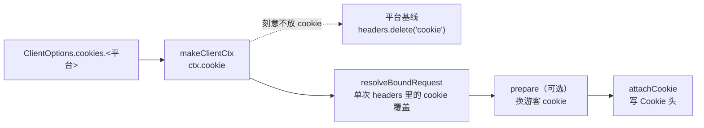

# 传输与签名

**全仓只有 `transport/` 能发请求。** 这是一条架构约束，不是习惯 —— 端点需要发请求（换游客 cookie、取 wbi key）只能通过 `ctx.send`，由 transport 注入。v6 里签名模块绕过统一入口直连 axios 的问题，在 v7 的结构下不再可能发生。

## HttpClient.send 做的事

一次 `send` 的内部顺序：

1. **构造 axios 配置** —— header 合并顺序是 **平台基线 → 实例 `requestConfig.headers` → 单次 `perCall.headers` → `spec.headers`**，每次都从输入重建 `AmagiHeaders`（大小写不敏感）。合并完再按 `spec.dropHeaders` 删头（见下），出口统一剥掉 `Edg/x.y` 标记，保留原 header 名的大小写。
2. **登记 trace 并计数** —— `tracer.begin(...)`，`meta.attempts` 恒等于登记条数。这一步与 `debug` 无关。
3. **发 `http:request` 事件**（装了总线时）。
4. **`axios(config)`**。
5. **成功** → 发 `http:response`，非 2xx 再补一条 `http:error`，返回 `RawResponse`。

`RawResponse` 带 `status` / `statusText` / `headers`（`AmagiHeaders`）/ `setCookie`（**原始数组**）/ `body` / `durationMs` / `url`。

<Callout type="info">
  **刻意不设 `validateStatus`。** 于是非 2xx 走 axios 的失败分支，由 transport 自己决定是不是重试。
  这与 v6 的 `transport/legacy.ts` 相反 —— 那里是 `validateStatus: () => true`，什么状态码都算成功。
</Callout>

## `spec.dropHeaders`：端点也能删基线头

`spec.headers` 只能**覆盖**同名头，给不出「这个端点不该发某个基线头」。快手 H5 端点撞上了这个缺口：平台基线是照桌面 Chrome 攒的（`origin` / `sec-ch-ua*` / `sec-fetch-*`），而 H5 端点用移动 UA —— 拼在一起发出去的请求自我矛盾（UA 说 iPhone Safari，客户端提示说 Chrome 142 / Windows，而 Safari 根本不发 `sec-ch-ua`）。

`dropHeaders` 在所有 merge 之后执行，所以**同时出现在 `headers` 与 `dropHeaders` 里的头会被删掉** —— 端点自己要发的头别写进清单。快手那份清单是 `platforms/kuaishou/config.ts` 的 `KUAISHOU_H5_DROP_HEADERS`。

<Callout type="warn">
  如实记账：这条能力不是为了修某个风控。`photo/info` 的 `2001` 在剥到只剩 6 个头之后仍然复现 —— 改它的理由只是「发出去的请求不该自我矛盾」。
</Callout>

## 失败分支的三条路

拿到 `AxiosError` 后先问 `decideRetry`：

| 判定 | 有响应？ | 行为 |
| ---- | -------- | ---- |
| 不重试 | 有 | 走正常返回路径，状态码原样带出（交给 judge 去判） |
| 不重试 | 无 | 发 `http:response` + `network:error`，**抛 `TransportError`** |
| 重试 | — | 发 `http:response`（+ 非 2xx 时 `http:error`）+ `network:retry`，`await sleep(delayMs)` 后继续 |

非 `AxiosError` 的抛出物原样上抛，由 `execute` 的唯一 catch 归到 `internal`。

## 重试策略

策略是纯函数模块，可以单独读、单独测：

| 常量 / 函数 | 值 / 行为 |
| ----------- | --------- |
| 可恢复 errno 白名单 | 9 个（`ECONNRESET` / `ETIMEDOUT` / `ENOTFOUND` 等） |
| `DEFAULT_MAX_RETRIES` | 3 |
| `RETRY_DELAY_BASE_MS` | 1000 |
| `backoffDelayMs(attempt)` | `base × 2^(attempt-1)` → 1s / 2s / 4s |
| `isRetryableStatus` | **429 与 ≥500** |
| `retryReasonCode` | `ETIMEDOUT` → `TIMEOUT`；其他可恢复 errno → `NETWORK_ERROR`；429 → `RATE_LIMITED`；5xx → `PLATFORM_UNAVAILABLE` |

超时没有 transport 自己的实现，靠 axios 的 `timeout`。四个平台的 `config.ts` 给的默认值是 10000ms，调用方的 `request.timeout` 可以覆盖。超时归因看 errno：`ETIMEDOUT` / `ECONNABORTED` → `kind: 'timeout'` / `code: 'TIMEOUT'`。

代理、adapter 与其余 axios 字段原样透传 —— `RequestConfig` 就是 `Omit<AxiosRequestConfig, 'url' | 'method' | 'data'>`，非 headers 字段在构造配置时展开（实例级在前，单次调用在后）。

## 四个平台的签名机制

签名器表与默认 judge 在 `client/runtime.ts` 的 `PLATFORM_RUNTIME` 里一次性装配，四个入口共用同一张表。

### 抖音

两个签名器，都先做前置校验再签，且**都以一步 secsdk 收尾**：

- **`a-bogus`**（15 个端点用）—— 先校验是绝对 URL，再用 `douyinSign.AB(spec.url, ctx.userAgent)` 把结果写进 query 的 `a_bogus`。
- **`x-bogus`**（1 个端点用）—— 先校验 pathname 至少 3 段且带 query，再写 query 的 `X-Bogus`。
- **`x-secsdk-web-signature`** —— 不是第三个签名器名，而是复合进上面两个的收尾一步。它与 AB / XB 有三点不同：**改写整条 URL**（签名算的是规范化后的 query，服务端也按收到的 query 校验，所以必须发它返回的那条 URL）、**只对 SDK 策略表里的 path 生效**（14 个 GET / 6 个 POST，表外原样返回）、**必须最后执行**（顺序是 a_bogus / x_bogus → 本签名，前者往 query 里加参数）。`uifid` 从 `ctx.cookie` 的 `UIFID` 取。

<Callout>
  **为什么不注册成第三个签名器名**：`sign` 是单槽位，而 secsdk 对策略表外是无操作 ——
  无条件套用是安全的。另起一个名字只会逼出 `'a-bogus+secsdk'` 这种复合命名。
  影响面上，`music/detail`（`musicInfo`）在策略表内，补上它之前实测 15/15 被
  `Blocked by ArgusSecurityPlugin Uifid Not Found` 拦死；作品详情、用户作品、
  喜欢列表也都在表内。`sign: false` 的端点不经过签名器，它们的 path 也都不在表里。
</Callout>

**签名读的 UA 是 `ctx.userAgent`**，它来自平台基线，且能被调用方的 `headers['user-agent']` 覆盖。这条链断掉的后果很难查：用空 UA 签名，服务端必然拒绝。

另有一个 Referer 注入 helper，6 个端点的 `build` 调它；调用方已经传了 `referer`（大小写不敏感）时不注入。

### B站

`wbi` 与 `qtparam` 两个签名器共享一个 `WbiSigner`：

- **`wbi`** —— 需要先取 nav 接口拿 key。取 nav 走的是 **`ctx.send(..., 'prepare')`**（不是直连 axios），带 30 分钟 TTL 缓存。签名用 `mixinKeyEncTab` 重排 + md5，产出 `&wts=..&w_rid=..`。
- **`qtparam`** —— cookie 为空时只加 `&platform=html5`；否则复用同一个 nav 结果读 `vipStatus`，VIP 加 `&fnval=4048&fourk=1`，非 VIP 加 `&qn=64&fnval=16`。签名基于**未加 fnval 的原始 URL**。

<Callout type="warn">
  **wbi key 缓存实际是进程级共享的，不是每实例一份。** `PLATFORM_RUNTIME` 是模块级 `const`，
  `createBilibiliSigners()` 在模块求值时只调用一次，所有 client 实例、静态 fetcher、HTTP 路由
  拿到的是同一个 `WbiSigner`。签名器源码里有三处注释写着「随实例」，与实现不符 ——
  以代码为准。这也意味着：两个用不同 cookie 的实例会共用同一份 wbi key。
</Callout>

### 小红书

三个签名器（`xhs-post` / `xhs-get` / `xhs-get-trace`）统一注入 `x-s` / `x-s-common` / `x-t`，带 trace 的那个再加 `x-b3-traceid`。签名路径取 `spec.signPath`，缺省取 URL 的 pathname。

`a1` 从 cookie 里**按名精确匹配**取（不是子串匹配 —— 子串匹配曾经是一个真实缺陷）。算法委托外部包的模块级单例。

唯一用 `prepare` 的端点也在这里：`homeFeed` 在 cookie 缺 `a1` 时先打三个请求换游客 cookie。

### 快手

一个签名器（`hxfalcon`），`live_api`（`/rest/k/*`）与 H5（`/rest/wd/*`）共用 —— 快手两套命名空间的签名算法是同一套，区别只在喂什么料。

签名的三份料全部从 spec 上取：

| 料 | 来源 | 说明 |
| -- | ---- | ---- |
| query | `spec.url` 解析 | 必须含 `caver`（它参与 sign input）。缺了就按签名器自己的 `catVersion` 补，补的值与最终发出的一致 |
| 签名路径 | `spec.signPath` | 与 `url` 的 pathname 不同（`userProfile` 的 12 个分片各有各的 `/rest/k/*` 规范路径） |
| 请求体 | `spec.body` | POST 端点必须参与签名 |

产物写回 URL（`__NS_hxfalcon` + `caver`）与请求头（`kww`）。`kww` 有匿名兜底，**签名从不读 cookie** —— cookie 只影响 `kww` 走登录分支还是匿名分支。

<Callout type="info">
  这里曾经是整个 transport 层最大的断链，两处**同时**漏在 `PLATFORM_RUNTIME.kuaishou`
  上：`signers` 没装（`KuaishouSigner` 写好了却零调用点，于是每个快手请求都不带签名，
  只能拿 cookie 当替代凭证）、`judge` 没装（`kuaishouJudge` 同样零调用点，业务失败全被
  兜底判成成功）。两者都不报编译错误、都不挂测试。现在 `test/client/runtime.test.ts`
  按平台遍历断言「signers 与 judge 都得有，且表里每项都是函数」，把这一类静默漏项钉住。
</Callout>

<Callout type="warn">
  **签名接上了，但 `photo/info` 现在不是快手单个作品的主通道。** 2026-09-05 实测：
  那条接口对 amagi 与对照项目一视同仁地回 `2001 antispam need captcha`，七个变量
  （签名 / 请求头 / did / cookie / 分享页预热 / 真 share 参数 / 数字 photoId）逐个排除
  后都是 2001；而快手自己的 H5 分享页 SSR 用的是**免签的** `ugH5App/photo/simple/info`。
  所以 `kuaishou.videoWork`（`/fetch_one_work`）走的是那条免签接口 —— 它**不声明 `sign`**，
  签名的完整版在 `kuaishou.videoWorkFull`（`/fetch_one_work_full`）。
  验签名到底有没有接上，要拿 `videoWorkFull` 或任一 `live_api` 端点验，别拿 `videoWork`。
</Callout>

### 风控挑战：`PLATFORM_RUNTIME.<平台>.challenge`

`signers` / `judge` 之外的**可选**第三项，目前只有快手装了（`parseKuaishouCaptcha`）。
`runtime/execute.ts` 在 judge 判出 `kind: 'risk'` 时调用它，结果进失败信封的
`error.challenge`（`{ url, jsSdkUrl?, session?, bizName?, result? }`）。

关键一点：**它不受 `debug` 管**。以前地址只能从 `error.raw` 里自己捞，而 `raw` 只有
`createClient({ debug: true })` 才有、`createXxxRoutes` 又不接 `debug` —— 于是最需要
滑块地址的入口（HTTP 服务）恰好是唯一结构上产不出它的入口。现在 client / HTTP 路由 /
静态 fetcher 三个入口都拿得到。

<Callout type="info">
  **只中转不绕过。** amagi 把验证页地址原样交给调用方，不引入任何识别、轨迹模拟或
  自动过验证的代码。取不出可信地址时返回 `undefined`，宁可不给也不把来路不明的 URL
  当验证页交出去。
</Callout>

### 其余三个平台的 judge

| 平台 | 判定要点 |
| ---- | -------- |
| 抖音 | `status_code` 缺失视为成功，非 0 一律 `unknown` / `PLATFORM_ERROR`（**刻意不按码分类** —— 抖音没有公开业务码表，同一个码在不同接口含义不同，真实码在 `error.platform.code`）；`filter_detail.filter_reason` → `forbidden` / `PRIVATE`；空响应体 → `auth` / `EMPTY_RESPONSE`；Argus 拦截文本 → `risk` / `ANTIBOT_PAGE`（可重试） |
| B站 | `code` 缺失或 0 成功；`-412` → `risk` / `RISK_CONTROL`；`-101` → `auth`；`-404` → `not_found` |
| 小红书 | 响应含 `<html>` → `risk` / `ANTIBOT_PAGE`，且标 `retryable` |

端点自带的 `judge` 优先于平台默认。

## cookie 的完整穿线

六个要点：

1. **来源**：实例是 `ClientOptions.cookies.<平台>`；静态形态是方法第二参；bound 形态是工厂第一参。
2. **基线里刻意不放 cookie**：`makeClientCtx` 拿到平台 config 后立刻 `headers.delete('cookie')`。否则单次调用的 cookie 覆盖会被实例头里的旧值遮蔽。
3. **单次覆盖**：从合并后的 headers 里大小写不敏感地取 `cookie`，取到就替换本次的 `ctx.cookie`。
4. **注入只在一处**：`execute` 的 `attachCookie`，send 之前。
5. **执行期可换**：`prepare` 返回的 `cookie` 会覆盖 ctx，换完的值经 `attachCookie` 生效。
6. **响应侧不回写**：`RawResponse.setCookie` 保留原始数组，但**不会**被写回 `ctx.cookie`。主管线里没有 cookie 自动刷新或轮转 —— 唯一的例外是抖音 passport 自带的 cookie jar 与小红书游客 cookie 的一次性生成。

cookie 解析全仓只有一份实现（`contracts/cookie.ts`）：大小写敏感、以第一个 `=` 分割、不做 URL 解码。

## 两个写了但没人读的字段

`RequestSpec` 上有两个字段，契约注释描述了用途，但通路不存在：

| 字段 | 注释说 | 实际 |
| ---- | ------ | ---- |
| `tag` | 会进 trace | trace 的类型里没有 `tag`。唯一写入点是抖音弹幕端点，无读取点 |
| `extra` | 透传给 sign / decode | `decode(raw, res)` 的签名拿不到 spec。唯一写入点是 B站 `qtparam` 写的 `isvip`，无读取点 |

写代码时不要依赖这两个字段传值。

## v6 的传输入口仍在

`transport/legacy.ts` 的 `fetchData` / `fetchResponse` / `getHeadersAndData` 保持 v6 语义并标了 `@deprecated`：`validateStatus: () => true`、只认大写 `User-Agent` 的 UA 清理、事件写 v6 的全局单例。

**抖音登录会话与 4 个 passport 方法仍走这条路** —— 详见[翻页与会话](/docs/v7/dev/internals/session)。
